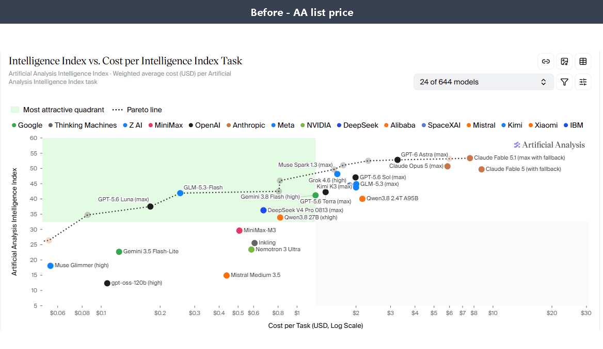

# RepriceAA

<p align="center">
  
  
  
  
  
</p>

<p align="center">
  <b>用「你实际支付的价格」重新计算 Artificial Analysis 基准的 Chrome 扩展。</b>
  <br>
  Artificial Analysis 按公开牌价为模型排名，而实际支出通常来自订阅、折扣 API 或中转渠道。
  RepriceAA 用你的有效价格重画 Intelligence Index 图表，使图上的性价比结论与你的真实成本一致。
</p>

<p align="center">
  同一张图，切换一个选项：Price Source <i>Artificial Analysis</i> → <b>★ Auto-best (cheapest)</b>
</p>

<p align="center">
  
</p>

## 背景

[Intelligence Index vs. Cost per Task](https://artificialanalysis.ai/models) 图表以公开的
$/M tokens 价格作为成本轴。当你通过订阅或折扣方案使用同一批模型时，每个模型的实际单价与
牌价不同，图表给出的"性价比前沿"也就不再适用于你的情况。

| | AA 牌价图表 | RepriceAA |
|---|---|---|
| 价格基准 | 公开 $/M tokens | 你的有效单价 |
| 订阅制套餐 | 不建模 | 按模型自动摊销 |
| 多个渠道 | 单一数字 | 逐一比较，取最低 |
| 性价比前沿 | 牌价 Pareto | *你的* Pareto |

*（示意性对比——结果取决于你配置的价格。）*

## 功能

RepriceAA 在任意 [artificialanalysis.ai](https://artificialanalysis.ai) 页面上注入侧边面板，
并与原生图表集成：

- **4 种规则类型**——`multiplier`（`0.5x`）、`absolute`（`$3/task`）、`formula`（`aaCost * 0.8 + 0.2`）、`exclude`
- **订阅摊销**——月费 + token 额度 → 自动计算被覆盖模型的有效单价
- **Best-of 模式**——每个模型在所有启用渠道中取最低价，并保留价格来源
- **回退链**——未覆盖的模型落到下一个渠道（检测循环，深度上限 3）
- **限时规则**——`until: 2026-12-31`，促销价到期自动失效
- **异常提示**——零成本、公式错误、渠道未覆盖等情况明确标出，不静默丢弃
- **跨页模型登记**——任意 AA 页面见过的模型缓存到本地（上限 600 条、14 天新鲜度），切页不丢点

## 安装

```bash
git clone <本仓库>
```

然后：`chrome://extensions` → 打开 **开发者模式** → **加载已解压的扩展程序** → 选中本目录。
访问任意 [artificialanalysis.ai](https://artificialanalysis.ai) 页面，点击右下角的紫色圆钮。

没有构建步骤，没有依赖，纯 JavaScript。

## 整体结构

```
AA 页面 ──→ 提取模型 ──→ 定价引擎 ──→ 重算后的散点面板
                │              │
                ↓              ↓
          本地模型登记       渠道规则 ──→ best-of / 回退链
                │              │
                └── chrome.storage（唯一权限）──┘
```

## 隐私

零网络请求，零统计埋点。仅申请一个权限（`storage`）；定价配置与模型缓存全部保留在本地浏览器中。

## 开发

```bash
node test/run-tests.js
```

42 个单元、集成与冒烟测试——零依赖。

<br>

<p align="center">
  <a href="README.md">English</a> · 简体中文
</p>

<p align="center">
  <sub>MIT — 详见 LICENSE</sub>
</p>
