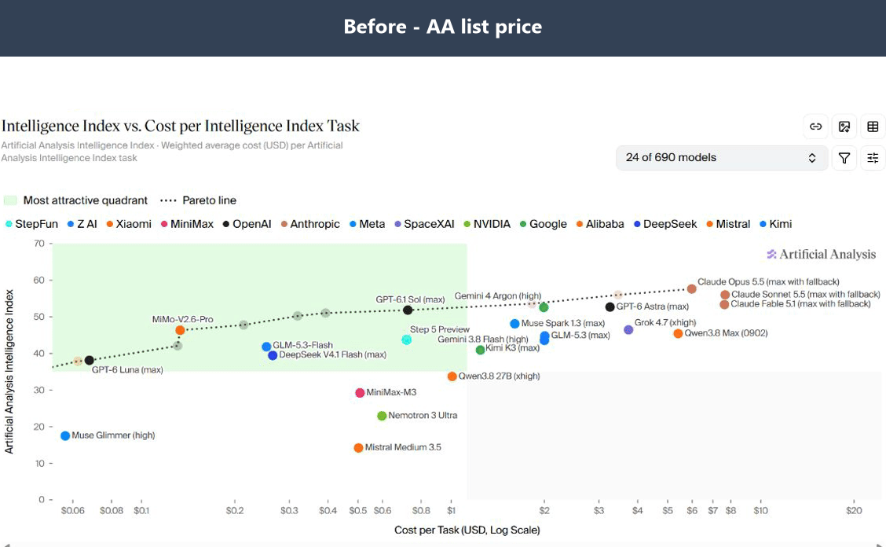

# RepriceAA

[English](README.md) · 简体中文 · [Releases](../../releases) · [MIT 许可证](LICENSE)

用你购买订阅、折扣 API 或其他渠道的实际价格，重新计算 [Artificial Analysis](https://artificialanalysis.ai/models) 图表中的模型成本。

将 **Price Source** 从 **Artificial Analysis** 切换为 **★ Auto-best (cheapest)**，即可按已启用渠道中的最低价比较模型。



*录制于 2026 年 10 月 5 日，实际结果取决于你配置的渠道和价格。*

## 安装

**Chrome 扩展**

1. 从 [Releases](../../releases) 下载 `repriceaa-vX.Y.Z.zip` 并解压。
2. 打开 `chrome://extensions`，启用 **开发者模式**。
3. 点击 **加载已解压的扩展程序**，选择解压后的文件夹。

也可以克隆本仓库后直接加载仓库目录，无需构建或安装依赖。

**用户脚本**

从 [Releases](../../releases) 下载 `repriceaa.user.js`，导入 Tampermonkey 或兼容的用户脚本管理器。

## 使用

1. 在 Artificial Analysis 打开受支持的 Intelligence Index **单任务成本**图表。
2. 点击 **RepriceAA → Sources**，检查启用的渠道或添加自己的定价。
3. 在图表的 **Price Source** 中选择某个渠道或 **Auto-best**。悬停数据点可查看价格详情；选择 **Artificial Analysis** 可恢复原图。

在未集成图表的页面，可点击右下角紫色 **RAA** 按钮打开面板。

## 功能

- **自定义定价**：倍率、固定单任务价格、公式和模型排除规则。
- **订阅摊销**：根据月费和各模型额度计算有效价格。
- **渠道比较**：逐模型选择已启用渠道中的最低价，保留价格来源并支持回退渠道。
- **图表集成**：重算性价比前沿，支持按模型发布分组的图表及不同推理档位。
- **定价维护**：促销规则到期失效、异常提示，以及内置定价预设自动更新。

## 隐私

定价配置和模型缓存保存在本地浏览器中，无统计埋点；扩展仅申请 `storage` 权限。扩展会从 GitHub 或 jsDelivr 下载公开定价预设，也可能请求 Artificial Analysis 的模型或发布详情页，以补全图表数据。

## 开发

```bash
node test/run-tests.js
node scripts/build-userscript.js repriceaa.user.js
```

纯 JavaScript。每个 Release 同时提供扩展 ZIP 和生成的用户脚本。
